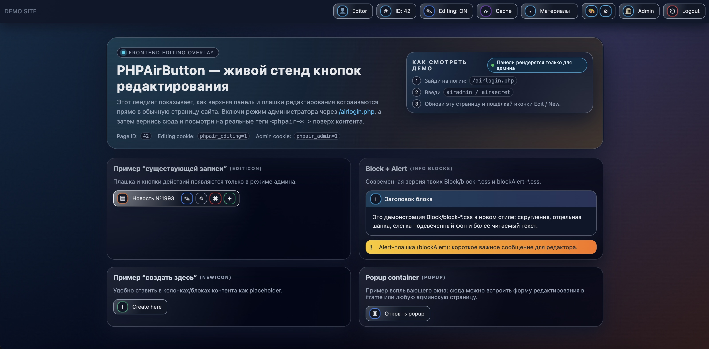

# PHPAirButtons — frontend editing overlay

Composer-пакет `iv-litovchenko/php-air-buttons`.

Пакет дает PHP-API (fluent builders) для вывода overlay UI (панель + “плашки” Edit/New) поверх обычной FE-страницы.

## Внешний вид


## Установка

```bash
composer require iv-litovchenko/php-air-buttons
```

## Автозагрузка / неймспейсы

Основной класс:
`IvLitovchenko\PhpAirButtons\PhpAirButtons`

## Почему демо и вход лежат в `public/`

Скрипты, которые открываются в браузере напрямую (`demo-landing.php`, `airlogin.php`), лежат в **`public/`** рядом со статикой overlay (`phpairbuttons.css`), а основной код пакета — в **`src/*.php`**.

Конфиг демо: **`public/phpair.demo.config.php`** — подробная настройка ниже.

## Конфигурация: `public/phpair.demo.config.php`

Это обычный PHP-файл, который **возвращает один массив** (`return [ ... ];`). Его подключают там, где собираешь страницу с панелью или демо:

```php
$cfg = require __DIR__ . '/phpair.demo.config.php'; // путь поправь под свой проект / копию файла
```

Можно **хранить копию** конфига у себя в проекте (не обязательно править файл внутри `vendor/`), а пути в `routes` задать под свой домен и ЧПУ.

### Структура верхнего уровня

| Ключ | Тип | Назначение |
|------|-----|------------|
| `expand_routes_non_default_port` | `bool` | Если `true` (в демо так и есть), относительные `routes` можно раскрыть в абсолютные URL. Явно `false` — не трогать `routes`. Ключ не задан — как `true`. См. также `routes_public_port`. Обработка: `PhpAirButtons::applyRouteExpansionFromConfig($cfg)`. |
| `routes_public_port` | int или `null` | **Явный порт** в абсолютных ссылках (`8080`, `3000`, …). `null` — брать из `$_SERVER['SERVER_PORT']`. Если задано число — ссылки собираются с этим портом (прокси, или просто явная настройка в файле). |
| `routes` | `array<string,string>` | URL для ссылок и кнопок верхней панели. |
| `page` | `array` | Условные данные «страницы» для демо (`id`, `title`). |
| `user` | `array` | Данные блока пользователя в панели (`name`). |

### Ключи `routes` (все строки — готовый URL или путь)

Они попадают в билдер **`adminPanelCreate()`** в `demo-landing.php` и в твой шаблон так же, если передашь те же поля.

| Ключ | Куда в панели | Что задать |
|------|----------------|------------|
| `home` | Ссылка бренда (логотип / название слева) | Демо: `demo-landing.php`. Сайт: `/` или главная. |
| `toggleEditing` | URL переключателя **Editing ON/OFF** | Должен открывать страницу, где **до HTML** вызывается `PhpAirButtons::handleEditingToggleRequest()`. Демо: `demo-landing.php?toggleEditing=1`. Сайт: текущий скрипт с `?toggleEditing=1`, например `/?toggleEditing=1`. |
| `clearCache` | Кнопка сброса кеша | Сейчас только ссылка (обработчик в пакете не встроен) — укажи свой роут или заглушку. |
| `colors` | Иконка «цвета» | То же: только URL, логики в пакете нет. |
| `settings` | Иконка настроек + второй аргумент `->user(..., $url)` | URL страницы настроек или заглушка. |
| `backend` | Ссылка «в админку» | Твой backend. |
| `logout` | Выход | Демо: `airlogin.php?logout=1`. Сайт: полный путь к скрипту выхода, например `/package/public/airlogin.php?logout=1`. |
| `login` | Подсказка/ссылка в тексте демо (не обязателен для самой панели) | Демо: `airlogin.php`. |

**Важно про URL:** для локального сервера `php -S localhost:8080 -t public` удобны **относительные** имена (`demo-landing.php`, `airlogin.php`). На боевом сайте чаще нужны **пути от корня** (`/`, `/admin/`, `/path/to/airlogin.php`). Библиотека не «магически» подставляет домен — в конфиге должна быть уже **твоя** строка URL.

**Порты в ссылках панели:** в **`phpair.demo.config.php`** смотри два ключа: **`expand_routes_non_default_port`** (`true`/`false`) и **`routes_public_port`** (`null` или число, например **`8080`** для `php -S localhost:8080`). Демо после `require` вызывает `PhpAirButtons::applyRouteExpansionFromConfig($cfg)`. Если порт **80** (HTTP) или **443** (HTTPS) и **`routes_public_port` = null**, раскрытие не выполняется. Явно заданный **`routes_public_port`** заставляет собрать абсолютные URL с этим портом. Вручную: `PhpAirButtons::expandRoutesForNonDefaultPort($cfg['routes'], $портИлиNull)`.

### `page` и `user`

- **`page['id']`**, **`page['title']`** — используются в демо (заголовок окна, подписи). В проде можешь подставлять id/заголовок из CMS.
- **`user['name']`** — имя в блоке пользователя панели (например `Editor` или ФИО).

### Пример: демо как в репозитории

Значения по умолчанию в файле рассчитаны на запуск из каталога `public` (см. **Локальный запуск** ниже): все ссылки вида `demo-landing.php?...` и `airlogin.php`.

### Пример: вшить панель в основной сайт

1. Скопируй `phpair.demo.config.php` в свой проект **или** подключай исходник из пакета одним `require`.
2. После `require` **переопредели** маршруты под свой сайт (минимум — `home`, `toggleEditing`, `login`, `logout`):

```php
// Удобнее держать копию у себя, например config/phpair-buttons.php
// Если пакет через Composer: часто лежит в vendor/iv-litovchenko/php-air-buttons/public/phpair.demo.config.php
$cfg = require __DIR__ . '/config/phpair-buttons.php';

$cfg['routes']['home']           = '/';
$cfg['routes']['toggleEditing']  = '/?toggleEditing=1';
$cfg['routes']['clearCache']     = '/?clearCache=1';
$cfg['routes']['colors']         = '/?colors=1';
$cfg['routes']['settings']       = '/office/settings';
$cfg['routes']['backend']        = '/admin/';
$cfg['routes']['login']          = '/path/to/airlogin.php';
$cfg['routes']['logout']         = '/path/to/airlogin.php?logout=1';

$cfg['user']['name'] = 'Иван Редактор';
$cfg['page']['id']   = (string) $currentPageId;
$cfg['page']['title']= $seoTitle;
```

3. На **каждой** странице, где есть переключатель editing, в **самом начале** PHP (до вывода HTML) вызывай `PhpAirButtons::handleEditingToggleRequest();`, иначе редирект по `toggleEditing` сломается из‑за «headers already sent».

Дополнительные пояснения в комментариях внутри **`public/phpair.demo.config.php`**.

## Использование в своем FE

### 1) CSS

CSS лежит в пакете: `public/phpairbuttons.css`.

При рендере верхней панели `PhpAirButtons::adminPanelCreate()->render()` CSS автоматически вставляется inline через `<style>`, поэтому вручную `<link>` обычно не нужен.

Если хочешь — можешь дополнительно подключить CSS отдельным `<link>` (ускорит/упростит кеширование), но базовый сценарий работает и без этого.

### 1.1) Авторизация (демо) и включение overlay

Внутри библиотеки включение панелей зависит от двух cookies:

- `phpair_admin=1` — “пользователь админ”
- `phpair_editing=1` — “режим редактирования включен”

Панели рисуются только когда выполняются оба условия.

#### Демо-вход

Для демо используется страница:

- `public/airlogin.php`

По умолчанию принимает:

- login: `airadmin`
- password: `airsecret`

После успешного входа выставляется cookie `phpair_admin=1`.

#### Переключение режима редактирования

Если на странице есть верхняя панель (то есть ты вызываешь `adminPanelCreate()->render()`), то он обрабатывает GET-параметр:

- `?toggleEditing=1`

При наличии `toggleEditing` библиотека:

- переключает `phpair_editing` (set `1` или `0`)
- делает редирект обратно (чтобы не было бесконечного переключения)

Чтобы не было предупреждений *headers already sent*, в точке входа страницы (до `<!DOCTYPE>` и любого `echo`) вызови:

`PhpAirButtons::handleEditingToggleRequest();`

Демо делает это в начале `public/demo-landing.php`. Если верхняя панель рендерится в самом верху шаблона до вывода, обработка также сработает из `adminPanelCreate()->render()`.

#### Logout (демо)

Чтобы выйти в демо, используй:

- `public/airlogin.php?logout=1`

Он очищает cookie `phpair_admin`.

### 2) Рендер верхней панели

```php
use IvLitovchenko\PhpAirButtons\PhpAirButtons;

PhpAirButtons::adminPanelCreate()
  ->brand('SITE', '/')
  ->user('Editor')
  ->pageId('42', '#page-info')
  ->editing(null, '/?toggleEditing=1')
  ->backend('/admin/')
  ->logout('/PHPAirButton/public/airlogin.php?logout=1')
  ->render();
```

(путь к `airlogin.php` подставь под свой префикс веб-сервера.)

### 3) Плашка существующей записи (EditIcon)

```php
use IvLitovchenko\PhpAirButtons\PhpAirButtons;

PhpAirButtons::editIcons()
  ->name('Новость')
  ->recordId('1993')
  ->editorUrl('/edit-record/1993')
  ->hideUrl('/hide-record/1993')
  ->deleteUrl('/delete-record/1993')
  ->createSiblingUrl('/new-from/1993')
  ->tooltip('Тип записи / заголовок элемента')
  ->render();
```

### 4) Placeholder создания (NewIcon)

```php
use IvLitovchenko\PhpAirButtons\PhpAirButtons;

PhpAirButtons::newIcon()
  ->name('Новость')
  ->createLink('/new?scope=tt_content')
  ->tooltip('Создать контент в этой колонке')
  ->render();
```

## Демо

В пакете есть демо-скрипты:

- `public/demo-landing.php`
- `public/airlogin.php`
- `public/phpair.demo.config.php`

### PHP на macOS через Homebrew

Если в терминале нет `php` или нужна свежая версия, поставь PHP через [Homebrew](https://brew.sh):

```bash
brew install php
php -v
```

После установки команда `php` обычно уже в `PATH` (перезапусти терминал при необходимости). Дальше можно поднимать демо встроенным сервером (ниже).

**Локальный запуск** (из корня пакета `PHPAirButton/`):

```bash
php -S localhost:8080 -t public
```

Открой в браузере: `http://localhost:8080/demo-landing.php` (вход: `http://localhost:8080/airlogin.php`, логин/пароль см. ниже).

## Assets

CSS файл доступен в пакете: `public/phpairbuttons.css`, но основной сценарий работы не требует `<link>`:
верхняя панель автоматически вставляет CSS inline через `<style>` при `adminPanelCreate()->render()`.

## Лицензия

Свободная: `MIT`. Автор: `litovchenko`.
